# AgentBoardroom

[](https://www.npmjs.com/package/agentboardroom)
[](https://github.com/GixGosu/AgentBoardroom/actions/workflows/ci.yml)
[](LICENSE)

**The difference between an agent that starts a project and one that finishes it.**

AgentBoardroom is a decision engine for autonomous multi-agent systems. Agents plan, challenge, build, validate, and ship — autonomously. The governance patterns are what make that trustworthy enough to run unsupervised for days: adversarial review catches design flaws before implementation, gate enforcement ensures each phase is actually done before moving on, decision lineage tells you exactly why every choice was made, and budget monitoring prevents the 80% stall.

Governance isn't suggested. It's **structurally enforced** at the infrastructure layer: agents *cannot* bypass challenges, skip gates, or modify the rules that govern them.

> Built by its own predecessor. [TheBoard](PLAYBOOK.md) — a 4-agent governance prototype — was tasked with building its own replacement. It planned the architecture, spawned worker teams, ran QA gates, and delivered AgentBoardroom across 5 phases: 25 source files, 209 tests, 5 board templates. The prototype governed the construction of the product that replaces it.

---

## What Autonomous Decision-Making Gets You

**Complete projects. Working code. One pass. Minimal human gates.**

Here are the receipts:

- **AgentBoardroom built itself** — 5 phases, 224 tests, 0 failures, ~8.5 hours of autonomous work. Human touched it twice: project brief at the start, merge approval at the end.
- **TheBoard built its successor** — The predecessor system autonomously designed, implemented, and delivered the replacement that obsoletes it. That's the proof.
- **25 failed attempts informed the design** — We know exactly which governance mechanisms matter because we watched agents fail without them. Every pattern in this system exists because its absence caused a project to drift, stall, or ship incomplete. ([Read the full story](PLAYBOOK.md))
- **2-3 minute smoke tests** — Full governance cycle (Brief → CEO plans → CTO challenges → Team builds → QA gates → Done) completes in minutes, not hours. Fast enough to verify, tight enough to trust.

### What This Looks Like

```
Human: [posts brief in #project-board]
  ↓
CEO: Decomposes into phases, assigns teams, posts plan
  ↓
CTO: Reviews architecture, challenges weak spots, accepts or counter-proposes
  ↓
Teams: Self-organize, execute work, post milestones
  ↓
QA: Validates output against original brief, issues gate verdict
  ↓
Done: Working deliverable, full audit trail, zero rework
```

One pass. Human touched it twice.

### Why Governance Matters

Without structural governance, agents drift. They start strong, then:

- **Design flaws emerge during implementation** → 3 days of rework because no one caught it early
- **Phases advance prematurely** → "80% done" projects that never finish the last mile
- **Decision context gets lost** → fixing a bug requires archaeology to understand why it was built that way
- **Token budgets run dry** → project stalls at the hardest part because the easy tasks burned the budget

Governance catches these **before** they become problems:

- **Adversarial review** → CTO challenges CEO's plan before teams start building. Design flaws caught in minutes, not discovered in week 2.
- **Gate enforcement** → QA verdict structurally blocks phase transitions. Can't advance until acceptance criteria are met. No false finishes.
- **Decision lineage** → Every significant choice is a queryable record with rationale, alternatives considered, and challenge history. When you need to fix something, you know exactly why it exists.
- **Budget monitoring** → Auditor tracks token spend per team and phase. Flags overruns before projects stall at 80%.

These aren't safety rails. They're what make autonomous decision-making trustworthy. Governance is how agents ship complete projects on the first pass — and keep shipping for days without human intervention.

---

## How It Works

AgentBoardroom is a decision engine that sits above your agent teams. Agents autonomously plan, challenge, build, and validate. The governance architecture is what makes those decisions reliable.

```mermaid
graph TB
    Chair["🪑 Board Chair (Human)<br/>Brief → Escalation → Review"]

    subgraph Boardroom["THE BOARDROOM"]
        CEO["CEO<br/>Strategy & Planning"]
        CTO["CTO<br/>Architecture"]
        QA["QA<br/>Gate Enforcement"]
        Auditor["Auditor<br/>Budget & Compliance"]

        CEO <-->|"challenge"| CTO
        CEO -->|"submit"| QA
        QA -->|"PASS/FAIL"| CEO
        Auditor -.->|"monitor"| CEO
        Auditor -.->|"monitor"| CTO
    end

    Chair -->|"project brief"| CEO
    QA -->|"escalate"| Chair
    Auditor -->|"alert"| Chair

    subgraph ProjA["Project Alpha (isolated)"]
        TeamA1["Team α<br/>src/core/"]
        TeamA2["Team β<br/>src/adapters/"]
    end

    subgraph ProjB["Project Beta (isolated)"]
        TeamB1["Team γ<br/>research/"]
    end

    CEO -->|"commission"| ProjA
    CEO -->|"commission"| ProjB
    QA -->|"gate verdict"| ProjA
    QA -->|"gate verdict"| ProjB

    ProjA x--x|"🔒 isolated"| ProjB

    style Chair fill:#e1f5ff,color:#000000
    style Boardroom fill:#fff9e6,color:#000000
    style ProjA fill:#e8f5e9,color:#000000
    style ProjB fill:#e8f5e9,color:#000000
    style CEO fill:#fff4e1,color:#000000
    style CTO fill:#fff4e1,color:#000000
    style QA fill:#fce4ec,color:#000000
    style Auditor fill:#f3e5f5,color:#000000
```



**The Boardroom decides. Projects run in isolation. Teams are sovereign. The human oversees.**

### The Governance Cycle

1. **CEO** receives a project brief and decomposes it into phases and team requirements
2. **CTO** challenges the plan for technical feasibility — accepts or rejects with counter-proposal
3. **Agent teams** are commissioned and self-organize to execute
4. **QA** validates output against the original brief and acceptance criteria
5. **QA gates** phase transitions — FAIL structurally blocks advancement
6. **Auditor** monitors budget, scope creep, and compliance on a scheduled cron
7. Every decision, challenge, and gate verdict is recorded in the decision graph

### Key Concepts

- **Challenge Protocol** — Agents structurally challenge each other's decisions before execution. Not optional. Not a prompt suggestion. Built into the architecture. Catches design flaws before implementation starts.
- **Decision Records** — Every significant decision is a queryable object with author, rationale, challenge history, and lineage. When you need to fix something, you know exactly why it was built that way.
- **Gate Enforcement** — QA verdicts are structural. A FAIL blocks phase advancement and returns work to the previous owner. No false finishes — phases advance only when acceptance criteria are met.
- **Separation of Powers** — No single agent has unchecked authority. Every decision passes through at least two perspectives.
- **Governance Protection** — Infrastructure-level prevention of self-modification. Agents cannot alter governance files, access out-of-scope resources, or cross team boundaries. Violations are logged and blocked.
- **Cross-Project Isolation** — Teams in Project A cannot see or affect Project B. Physical state isolation enforced at the access control layer.

---

## What Makes This Different

Multi-agent frameworks coordinate work. AgentBoardroom is not a framework — it's a **decision engine** that sits above them. Agents make every planning, review, and validation decision autonomously. The governance patterns are what make that safe to run unsupervised.

- **Enforced, not suggested** — Challenge protocols, gate verdicts, and access controls are infrastructure constraints, not prompt instructions. `GovernanceProtection` prevents agents from modifying governance files. File-level access control prevents cross-team interference. Self-modification prevention ensures no agent can rewrite the rules that bind it. ([Constitution Article IX](CONSTITUTION.md))
- **Federal multi-project model** — Run multiple concurrent projects with full isolation. Each project gets independent state, budget, teams, and lifecycle. A resource allocator distributes worker pools and model capacity across projects based on priority.
- **Adversarial by design** — Every significant decision is challenged before execution. Every phase transition is independently validated. Every resource spend is audited on a cron. The architecture doesn't trust any single agent — including the one at the top.

These patterns also provide **safety and compliance**: decision lineage creates audit trails, separation of powers prevents runaway autonomy, gate enforcement ensures human review points. But safety is the byproduct. The goal is **completion**. Governance is how autonomous agents ship projects that work on the first pass.

---

## Multi-Project Governance

AgentBoardroom implements a **federal model**: the Boardroom governs at the top level, while each project operates as a sovereign unit with its own state, teams, budget, and lifecycle.

```bash
# List all projects
agentboardroom projects

# Priority-based resource allocation across projects
agentboardroom projects --prioritize
```

The system includes:

- **Project Registry** — Independent lifecycle management (active / paused / completed) with per-project state directories
- **Resource Allocator** — CEO distributes worker pools, model capacity, and token budgets across competing projects based on priority
- **Isolation Enforcer** — Cross-project access is structurally denied. Teams in one project cannot read, write, or execute resources belonging to another

See [`src/projects/`](src/projects/) for the implementation: `registry.ts`, `allocator.ts`, `isolation.ts`.

## Quick Start

```bash
# Install
npm install agentboardroom

# Initialize a new board
agentboardroom init --template software-dev --project my-app

# Check status
agentboardroom status

# Query decisions and gates
agentboardroom decisions --project my-app
agentboardroom gates --project my-app
```

For a complete walkthrough, see the **[Quick Start Guide](docs/QUICKSTART.md)**.

## Board Templates

AgentBoardroom ships with pre-built governance configurations for different domains:

| Template | Roles | Use Case | Guide |
|---|---|---|---|
| `software-dev` | CEO, CTO, QA, Auditor | Ship code autonomously | [→](docs/templates/software-dev.md) |
| `research` | PI, Methodologist, Reviewer, Fact-Checker | Deep research with verification | [→](docs/templates/research.md) |
| `content` | Editor, Writer, Fact-Checker, Style Auditor | Content pipelines with quality gates | [→](docs/templates/content.md) |
| `ops-incident` | Commander, SRE, Comms, Auditor | Incident response with coordination | [→](docs/templates/ops-incident.md) |
| `custom` | User-defined | Build your own governance structure | [→](docs/templates/custom.md) |

## CLI

The `agentboardroom` CLI provides 6 commands for managing boards and projects:

```bash
agentboardroom init              # Initialize a new board from a template
agentboardroom status            # Display board/project status
agentboardroom decisions         # Query decision log (filter by --author, --challenged, --phase, --format)
agentboardroom record-decision   # Record a governance decision (for agents to create decision records)
agentboardroom gates             # Query gate verdict history
agentboardroom projects          # Multi-project management (list, prioritize)
```

### Recording Decisions (for agents)

Agents use `record-decision` to formally record governance decisions:

```bash
# CEO approves a plan
agentboardroom record-decision \
  --author ceo \
  --type planning \
  --summary "Approve Phase 1 implementation plan" \
  --rationale "Plan is well-structured, parallelizable, within budget" \
  --project my-app \
  --phase 1 \
  --status accepted

# CTO challenges architecture
agentboardroom record-decision \
  --author cto \
  --type architecture \
  --summary "Challenge: Circular dependency in module structure" \
  --rationale "Module A depends on B which depends on A. Refactor needed." \
  --project my-app \
  --phase 1 \
  --status challenged

# QA records gate verdict
agentboardroom record-decision \
  --author qa \
  --type gate \
  --summary "Phase 1 gate: PASS (95/100 tests, 82% coverage)" \
  --rationale "All critical tests passing. Coverage above threshold." \
  --project my-app \
  --phase 1 \
  --status accepted
```

Full reference: **[CLI Usage Guide](docs/CLI-USAGE.md)**

## Documentation

| Document | Description |
|---|---|
| **[Quick Start](docs/QUICKSTART.md)** | 10-minute setup guide |
| **[Architecture](docs/ARCHITECTURE.md)** | System design, module breakdown, adapter pattern |
| **[CLI Usage](docs/CLI-USAGE.md)** | Complete CLI reference with examples |
| **[Template Customization](docs/TEMPLATE-CUSTOMIZATION.md)** | How to customize and create templates |
| **[Startup Verification](docs/STARTUP-VERIFICATION.md)** | 5-step smoke test to verify your board is live |
| **[Constitution](CONSTITUTION.md)** | Formal governance specification — separation of powers, role definitions, enforcement mechanisms |
| **[Playbook](PLAYBOOK.md)** | Origin story, failure modes, and design rationale — the "why" behind every pattern |

### Template Guides

- [Software Development](docs/templates/software-dev.md)
- [Research](docs/templates/research.md)
- [Content](docs/templates/content.md)
- [Ops / Incident Response](docs/templates/ops-incident.md)
- [Custom](docs/templates/custom.md)

## Communicating with the Board

AgentBoardroom uses Mattermost channels as its communication layer. Each channel has a purpose:

| Channel | Purpose | Who Monitors |
|---|---|---|
| `#<project>-board` | Board Chair ↔ CEO communication. Post project briefs here. | CEO, all board agents |
| `#<project>-ceo` | CEO planning visibility. Status updates, phase transitions. | Board Chair, CTO |
| `#<project>-cto` | CTO architecture decisions and technical reviews. | Board Chair, CEO |
| `#<project>-decisions` | Append-only decision log. Every Decision Record posted here. | Auditor, Board Chair |

### How to Interact

**Post a project brief** → Write it in `#<project>-board`. The CEO picks it up, decomposes it, and begins the governance cycle.

**Check status** → Ask in `#<project>-board` or use `agentboardroom status`. The CEO responds with current phase, blockers, and team progress.

**Escalations come to you** → When the challenge protocol exceeds max rounds or a gate fails repeatedly, the system escalates to `#<project>-board` with full context and recommended actions.

**Talk to a specific agent** → Post in their channel (`#<project>-cto` for architecture questions). Each agent monitors their own channel.

**Emergency stop** → Post `EMERGENCY STOP` in `#<project>-board`. All agents acknowledge and halt. Resume with `RESUME`.

**From any channel** → Board agents are OpenClaw sessions. You can reference them from any channel your OpenClaw instance monitors — ask your agent to relay a message to the CEO, check board status, or post a brief on your behalf. You don't have to be in a board channel to interact with the board.

### Audit Trail

Every decision, challenge, gate verdict, and budget alert is posted to channels and persisted to `state/<project>/`. Nothing happens off the record. The Auditor runs on a cron schedule and flags anomalies — budget overruns, scope creep, stalled teams — directly to the board channel.

## Why Governance?

Most multi-agent systems use hub-and-spoke: one coordinator dispatches to workers. That's a management structure. It fails when the coordinator drifts, and nothing in the architecture prevents drift.

AgentBoardroom uses committee governance. The coordinator is challenged before execution, gated during transitions, and audited throughout. The architecture doesn't trust any single agent — including the one at the top.

The patterns aren't new. Separation of powers, adversarial review, independent audit, structural gates — these are centuries-old governance concepts. Applying them to AI agents is what's new. For the full story of how we learned this the hard way, read the **[Playbook](PLAYBOOK.md)**.

## Built With

- [OpenClaw](https://github.com/openclaw/openclaw) — Agent runtime (session management, cross-agent messaging, cron, tool access)
- [Mattermost](https://mattermost.com/) — Communication and audit trail (also supports Discord, Slack)

## License

MIT

## Credits

Built by [Cyberarctica Labs](https://cyberarctica.com).

---

*"We built governments because people fail. We built AgentBoardroom because agents do too."*
