```mermaid
graph TB
    Chair["🪑 Board Chair (Human)<br/>Brief → Escalation → Review"]

    subgraph Boardroom["THE BOARDROOM"]
        CEO["CEO<br/>Strategy & Planning"]
        CTO["CTO<br/>Architecture"]
        QA["QA<br/>Gate Enforcement"]
        Auditor["Auditor<br/>Budget & Compliance"]

        CEO <-->|"challenge"| CTO
        CEO -->|"submit"| QA
        QA -->|"PASS/FAIL"| CEO
        Auditor -.->|"monitor"| CEO
        Auditor -.->|"monitor"| CTO
    end

    Chair -->|"project brief"| CEO
    QA -->|"escalate"| Chair
    Auditor -->|"alert"| Chair

    subgraph ProjA["Project Alpha (isolated)"]
        TeamA1["Team α<br/>src/core/"]
        TeamA2["Team β<br/>src/adapters/"]
    end

    subgraph ProjB["Project Beta (isolated)"]
        TeamB1["Team γ<br/>research/"]
    end

    CEO -->|"commission"| ProjA
    CEO -->|"commission"| ProjB
    QA -->|"gate verdict"| ProjA
    QA -->|"gate verdict"| ProjB

    ProjA x--x|"🔒 isolated"| ProjB

    style Chair fill:#e1f5ff,color:#000000
    style Boardroom fill:#fff9e6,color:#000000
    style ProjA fill:#e8f5e9,color:#000000
    style ProjB fill:#e8f5e9,color:#000000
    style CEO fill:#fff4e1,color:#000000
    style CTO fill:#fff4e1,color:#000000
    style QA fill:#fce4ec,color:#000000
    style Auditor fill:#f3e5f5,color:#000000
```

# AgentBoardroom

[](https://www.npmjs.com/package/agentboardroom)
[](https://github.com/GixGosu/AgentBoardroom/actions/workflows/ci.yml)
[](LICENSE)

**Corporate governance for AI agents.**

AgentBoardroom is a decision intelligence platform that applies governance patterns — adversarial review, gate enforcement, separation of powers, and audit trails — to autonomous multi-agent systems. Governance isn't suggested. It's **structurally enforced** at the infrastructure layer: agents *cannot* bypass challenges, skip gates, or modify the rules that govern them.

> Built by its own predecessor. [TheBoard](PLAYBOOK.md) — a 4-agent governance prototype — was tasked with building its own replacement. It planned the architecture, spawned worker teams, ran QA gates, and delivered AgentBoardroom across 5 phases: 25 source files, 209 tests, 5 board templates. The prototype governed the construction of the product that replaces it.

---

## What Makes This Different

Multi-agent frameworks coordinate work. AgentBoardroom is not a framework — it's a **governance layer** that sits above them.

- **Enforced, not suggested** — Challenge protocols, gate verdicts, and access controls are infrastructure constraints, not prompt instructions. `GovernanceProtection` prevents agents from modifying governance files. File-level access control prevents cross-team interference. Self-modification prevention ensures no agent can rewrite the rules that bind it. ([Constitution Article IX](CONSTITUTION.md))
- **Federal multi-project model** — Run multiple concurrent projects with full isolation. Each project gets independent state, budget, teams, and lifecycle. A resource allocator distributes worker pools and model capacity across projects based on priority.
- **Adversarial by design** — Every significant decision is challenged before execution. Every phase transition is independently validated. Every resource spend is audited on a cron. The architecture doesn't trust any single agent — including the one at the top.

---

## How It Works

AgentBoardroom is a governance layer that sits above your agent teams. It doesn't do the work — it governs the agents that do.



**The Boardroom governs. Projects run in isolation. Teams are sovereign. The human oversees.**

### The Governance Cycle

1. **CEO** receives a project brief and decomposes it into phases and team requirements
2. **CTO** challenges the plan for technical feasibility — accepts or rejects with counter-proposal
3. **Agent teams** are commissioned and self-organize to execute
4. **QA** validates output against the original brief and acceptance criteria
5. **QA gates** phase transitions — FAIL structurally blocks advancement
6. **Auditor** monitors budget, scope creep, and compliance on a scheduled cron
7. Every decision, challenge, and gate verdict is recorded in the decision graph

### Key Concepts

- **Challenge Protocol** — Agents structurally challenge each other's decisions before execution. Not optional. Not a prompt suggestion. Built into the architecture.
- **Decision Records** — Every significant decision is a queryable object with author, rationale, challenge history, and lineage.
- **Gate Enforcement** — QA verdicts are structural. A FAIL blocks phase advancement and returns work to the previous owner.
- **Separation of Powers** — No single agent has unchecked authority. Every decision passes through at least two perspectives.
- **Governance Protection** — Infrastructure-level prevention of self-modification. Agents cannot alter governance files, access out-of-scope resources, or cross team boundaries. Violations are logged and blocked.
- **Cross-Project Isolation** — Teams in Project A cannot see or affect Project B. Physical state isolation enforced at the access control layer.

## Multi-Project Governance

AgentBoardroom implements a **federal model**: the Boardroom governs at the top level, while each project operates as a sovereign unit with its own state, teams, budget, and lifecycle.

```bash
# List all projects
agentboardroom projects

# Priority-based resource allocation across projects
agentboardroom projects --prioritize
```

The system includes:

- **Project Registry** — Independent lifecycle management (active / paused / completed) with per-project state directories
- **Resource Allocator** — CEO distributes worker pools, model capacity, and token budgets across competing projects based on priority
- **Isolation Enforcer** — Cross-project access is structurally denied. Teams in one project cannot read, write, or execute resources belonging to another

See [`src/projects/`](src/projects/) for the implementation: `registry.ts`, `allocator.ts`, `isolation.ts`.

## Quick Start

```bash
# Install
npm install agentboardroom

# Initialize a new board
agentboardroom init --template software-dev --project my-app

# Check status
agentboardroom status

# Query decisions and gates
agentboardroom decisions --project my-app
agentboardroom gates --project my-app
```

For a complete walkthrough, see the **[Quick Start Guide](docs/QUICKSTART.md)**.

## Board Templates

AgentBoardroom ships with pre-built governance configurations for different domains:

| Template | Roles | Use Case | Guide |
|---|---|---|---|
| `software-dev` | CEO, CTO, QA, Auditor | Ship code autonomously | [→](docs/templates/software-dev.md) |
| `research` | PI, Methodologist, Reviewer, Fact-Checker | Deep research with verification | [→](docs/templates/research.md) |
| `content` | Editor, Writer, Fact-Checker, Style Auditor | Content pipelines with quality gates | [→](docs/templates/content.md) |
| `ops-incident` | Commander, SRE, Comms, Auditor | Incident response with coordination | [→](docs/templates/ops-incident.md) |
| `custom` | User-defined | Build your own governance structure | [→](docs/templates/custom.md) |

## CLI

The `agentboardroom` CLI provides 5 commands for managing boards and projects:

```bash
agentboardroom init         # Initialize a new board from a template
agentboardroom status       # Display board/project status
agentboardroom decisions    # Query decision log
agentboardroom gates        # Query gate verdict history
agentboardroom projects     # Multi-project management (list, prioritize)
```

Full reference: **[CLI Usage Guide](docs/CLI-USAGE.md)**

## Documentation

| Document | Description |
|---|---|
| **[Quick Start](docs/QUICKSTART.md)** | 10-minute setup guide |
| **[Architecture](docs/ARCHITECTURE.md)** | System design, module breakdown, adapter pattern |
| **[CLI Usage](docs/CLI-USAGE.md)** | Complete CLI reference with examples |
| **[Template Customization](docs/TEMPLATE-CUSTOMIZATION.md)** | How to customize and create templates |
| **[Constitution](CONSTITUTION.md)** | Formal governance specification — separation of powers, role definitions, enforcement mechanisms |
| **[Playbook](PLAYBOOK.md)** | Origin story, failure modes, and design rationale — the "why" behind every pattern |

### Phase Summaries

- [Phase 2 Summary](docs/PHASE-2-SUMMARY.md) — Governance enforcement, file access control, audit logging
- [Phase 3 Summary](docs/phase-3-summary.md) — Multi-project registry, resource allocation, isolation
- [Phase 3 Integration Guide](docs/phase-3-integration-guide.md) — How to integrate multi-project features
- [Phase 4 Summary](docs/PHASE-4-SUMMARY.md) — CLI, templates, and packaging

### Template Guides

- [Software Development](docs/templates/software-dev.md)
- [Research](docs/templates/research.md)
- [Content](docs/templates/content.md)
- [Ops / Incident Response](docs/templates/ops-incident.md)
- [Custom](docs/templates/custom.md)

## Why Governance?

Most multi-agent systems use hub-and-spoke: one coordinator dispatches to workers. That's a management structure. It fails when the coordinator drifts, and nothing in the architecture prevents drift.

AgentBoardroom uses committee governance. The coordinator is challenged before execution, gated during transitions, and audited throughout. The architecture doesn't trust any single agent — including the one at the top.

The patterns aren't new. Separation of powers, adversarial review, independent audit, structural gates — these are centuries-old governance concepts. Applying them to AI agents is what's new. For the full story of how we learned this the hard way, read the **[Playbook](PLAYBOOK.md)**.

## Built With

- [OpenClaw](https://github.com/openclaw/openclaw) — Agent runtime (session management, cross-agent messaging, cron, tool access)
- [Mattermost](https://mattermost.com/) — Communication and audit trail (also supports Discord, Slack)

## License

MIT

## Credits

Built by [Cyberarctica Labs](https://cyberarctica.com).

---

*"We built governments because people fail. We built AgentBoardroom because agents do too."*
